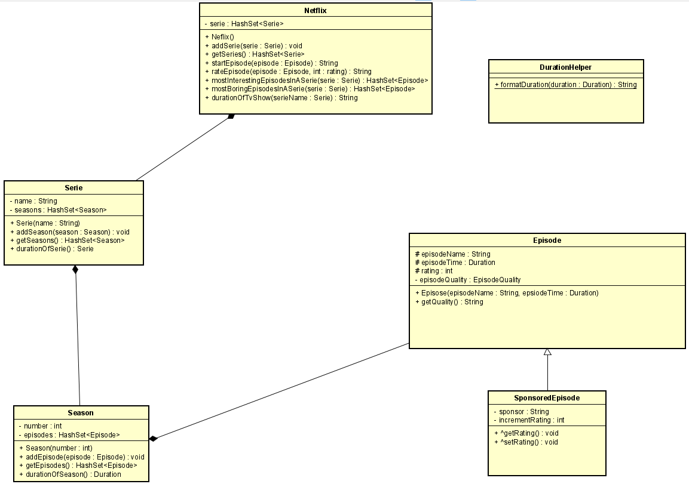

## Netflix

## Problem Description
A Netflix that allows users to watch any **series** of their choice.
A Serie will have a name and will contain seasons and their episodes.

The following are the features for the Netflix
* The user can start an episode. When started it shows the duration.
* The user can rate an episode (1 to 5). Also, episode that are sponsored counts one rating x2.
* Netflix shows the most interesting episodes per series also the most boring.
* The complete time in hh:mm:ss for a complete season and a serie will be shown

These features will be implemented to solve the problem above.

### **Input and Output**

this section describes the input and output of the application.

**Episode Input.**

| Case            |      Type      |      Conditions |
| --------------- | :------------: | --------------: |
| Episode name    |     String     |       not empty |
| duration        |    Duration    |              mm |
| Rating          |      int       | < 0 rating <= 5 |
| episode Quality | EpisodeQuality |                 |

**Episode Output**

| Case                |      Type      |
| ------------------- | :------------: |
| Name of episode     |     String     |
| Duration of episode |    Duration    |
| Get the Rating      |      int       |
| episode Quality     | EpisodeQuality |

**Season Input.**

| Case          |        Type        | Conditions |
| ------------- | :----------------: | ---------: |
| Season number |        int         |   (! < 0 ) |
| Add Episode   | `HashSet<Episode>` |          - |

**Season Output**

| Case                  |        Type        |
| --------------------- | :----------------: |
| Season number         |        int         |
| Get Episode in Season | `HashSet<Episode>` |
| durationOfSeason      |      Duration      |

**Serie Input.**

| Case       |       Type        | Conditions |
| ---------- | :---------------: | ---------: |
| Serie name |      String       |  not empty |
| Add Season | `HashSet<Season>` |          - |

**Serie Output.**

| Case            |       Type        |
| --------------- | :---------------: |
| Get serie name  |      String       |
| Get Season      | `HashSet<Season>` |
| durationOfSerie |     Duration      |

**Netflix Input.**

| Case                |        Type        |                   Conditions |
| ------------------- | :----------------: | ---------------------------: |
| Add serie           |  `HashSet<Serie>`  |                            - |
| Start Episode       |       String       |                              |
| Rate Episode        |       String       |                              |
| Most interesting    | `HashSet<Episode>` | if episode rating is equal 5 |
| Most boring         | `HashSet<Episode>` |       if episode rating is 1 |
| duration of tv show |       String       |               The serie name |

**Netflix Output.**

| Case                |        Type        |
| ------------------- | :----------------: |
| return serie        |  `HashSet<Serie>`  |
| duration of episode |       String       |
| Rate Episode        |       String       |
| Most interesting    | `HashSet<Episode>` |
| duration of season  |       String       |

**Remarks**

* Input are  validated
* HashSet is used as the collection to avoid duplicate data.
* Only the Main class will contain System.out.println.
* The code is commented
* Unit test is  written for this application.

## UML

## Testplan

The section describes the testcases to test the application.

### **Test Data **

### **Episodes**

| Episode      | Type             |
| ------------ | ---------------- |
| episodeOne   | Episode          |
| episodeTwo   | SponsoredEpisode |
| episodeThree | Episode          |
| episodeFour  | SponsoredEpisode |

**Season**

| Season    | number |
| --------- | ------ |
| seasonOne | 1      |
| seasonTwo | 2      |

**Serie**

| Serie        | name         |
| ------------ | ------------ |
| got          | got          |
| supernatural | supernatural |

### **Created  multiple episodes**

| Episode      | episodeName | episodeTime | EpisodeQuality | Sponsor |
| ------------ | ----------- | ----------- | -------------- | ------- |
| episodeOne   | good        | 60          | HD             |         |
| episodeTwo   | die hard    | 30          | SD             | coke    |
| episodeThree | Action      | 30          | SD             |         |
| episodeFour  | ghost       | 120         | _4K            | bet9ja  |

## **TestCase**

## **Netflix**

### **startEpisode**

| #    | input      | Action         | Expected Result                                 |
| ---- | ---------- | -------------- | ----------------------------------------------- |
| 1    | episodeOne | startEpisode() | episode good started duration 1:00:00 serie got |

### **startEpisodeNotFound**

| #    | Input        | Action                                               | Expected Result |
| ---- | ------------ | ---------------------------------------------------- | --------------- |
| 1    | episodeThree | startEpisode() seasonTwo.addEpisode(episodeOne) |                 |

### **rateEpisode**

| #    | Input         | Action        | Expected Result                   |
| ---- | ------------- | ------------- | --------------------------------- |
| 1    | episodeOne, 1 | rateEpisode() | good has been given a rating of 1 |

### **rateSponsoredEpisode**

| #    | input         | Action        | Expected Result                                              |
| ---- | ------------- | ------------- | ------------------------------------------------------------ |
| 1    | episodeTwo, 3 | rateEpisode() | die hard is sponsored by coke and rating is 5. So, Netflix earn extra cash |

### **rateEpisodeOutOfScope**

| #    | input          | Action        | Expected Result                   |
| ---- | -------------- | ------------- | --------------------------------- |
| 1    | episodeOne, -1 | rateEpisode() | good has been given a rating of 0 |

**rateSponsoredEpisodeOutOfScope**

| #    | input         | Action        | Expected Result                                              |
| ---- | ------------- | ------------- | ------------------------------------------------------------ |
| 1    | episodeTwo, 5 | rateEpisode() | die hard is sponsored by coke has been given a rating of 0. So, Netflix earn extra cash |

### **mostInterestingEpisodeInASerie**

| #    | Input | Action                                                       | Expected Result |
| ---- | ----- | ------------------------------------------------------------ | --------------- |
| 1    | got   | mostInterestingEpisodesInASerie() episodeThree.setRating(5) episodeOne.setRating(5)   mostInteresting.add(episodeOne)  mostInteresting.add(episodeThree) | mostInteresting |

### **mostBoringEpisode**

| #    | input        | Action                                                       | Expected Result |
| ---- | ------------ | ------------------------------------------------------------ | --------------- |
| 1    | supernatural | mostBoringEpisodeInASerie(),  episodeOne.setRating(1); episodeTwo.setRating(4); episodeThree.setRating(1);  mostBoring.add(episodeOne)   mostBoring.add(episodThree) | mostBoring      |

### **durationOfTvShow**

| Input              | Action             | Expected                                               |
| ------------------ | ------------------ | ------------------------------------------------------ |
| got seasonOne | durationOfTvShow() | The complete running time of got season two is 3:23:52 |

### **getQuality**

| #    | input        | Action                    | Expected Result             |
| ---- | ------------ | ------------------------- | --------------------------- |
| 1    | episodeOne   | episodeOne.getQuality()   | you are playing an HD video |
| 2    | episodeTwo.  | episodeTwo.getQuality()   | you are playing an SD video |
| 3    | episodeThree | episodeThree.getQuality() | you are playing a 4K video  |

### **durationOfSeason**

| #    | input                  | Action                                                       | Expected Result |
| ---- | ---------------------- | ------------------------------------------------------------ | --------------- |
| 1    | episodeOne, episodeTwo | seasonOne.addEpisode(episodeOne); seasonOne.addEpisode(episodeThree) | 1:30:00         |

durationOfSerie

| #    | input                    | Action                                                       | Expected Result |
| ---- | ------------------------ | ------------------------------------------------------------ | --------------- |
| 1    | seasonOne seasonTwo | seasonOne.addEpisode(episodeOne); seasonOne.addEpisode(episodeTwo); seasonTwo.addEpisode(episodeThree); seasonTwo.addEpisode(episodeFour); | 4:00:00         |

